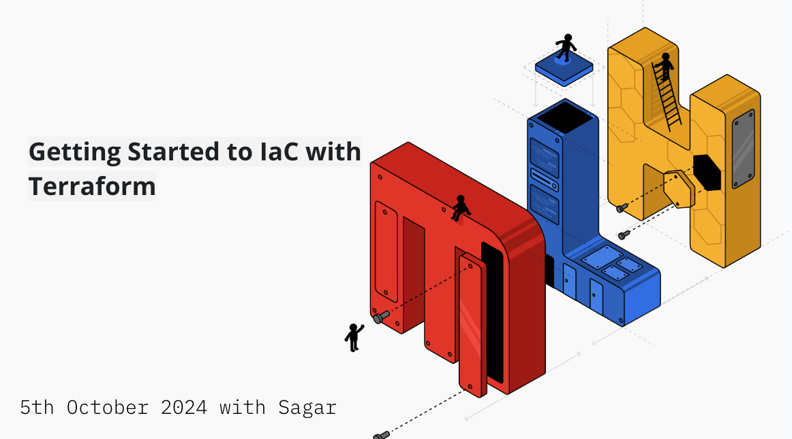

# Terraform AWS Infrastructure Deployment (NodeJs API on EC2)

## Overview
This repository contains Terraform code to provision necessary resources and deploy a monolith Node.js application to AWS Elastic Compute Cloud (EC2). 

## Resources Created

* 1x VPC
* 1x Subnet
* 1x Internet Gateway
* 1x Routing Table
* 2x Security Groups (ssh, http)
* 1x Virtual Machine (t2.micro)

## Demo Architecture

## Guiding Video Tutorials and Notion Guide

1. Full Notion Guide: Click [Here](https://bit.ly/terraform-with-sagar). Watch Full Tutorial 👇

## Prerequisites
- AWS Account with AdministratorAccess
- Terraform CLI installed

## Installation
To use this project, follow these steps:
1. Clone the repository: `git clone https://github.com/adexltd/lms-ecs-ec2-terraform`
2. Navigate to the cloned directory: `cd lms-ecs-ec2-terraform`

## Getting Started

1. Run `terraform init` to initialize the provider and modules.
2. Run `terraform plan --var-file="dev.tfvars"` to see the changes that will be made.
3. Run `terraform apply --var-file="dev.tfvars"` to apply the changes.
4. **Caution:** Run `terraform destroy --var-file="dev.tfvars"` to destroy and cleanup all the resources.

## Project Structure

- `main.tf`:  This file is executed by Terraform to create, modify, or destroy the resources defined in it.
- `variable.tf`: Variables can be used for a variety of purposes such as storing sensitive information, providing inputs to resources, or defining defaults for a module.
- `provider.tf`: The provider blocks in Terraform configuration files represent the cloud infrastructure or services that be managed by Terraform. Providers allow Terraform to deploy and manage resources in different cloud environments such as AWS, Azure, Google Cloud Platform, and more.
- `output.tf`: Description of what this file does.
- `.gitignore`: List of files to ignore in version control.

## Contributing
Contributions to this project are welcome. Please follow these steps:
1. Fork the repository
2. Create a new branch: `git checkout -b feature-branch`
3. Commit your changes and push to the branch
4. Create a pull request

## License
This repo is licensed under [The MIT License](https://opensource.org/license/mit/)

